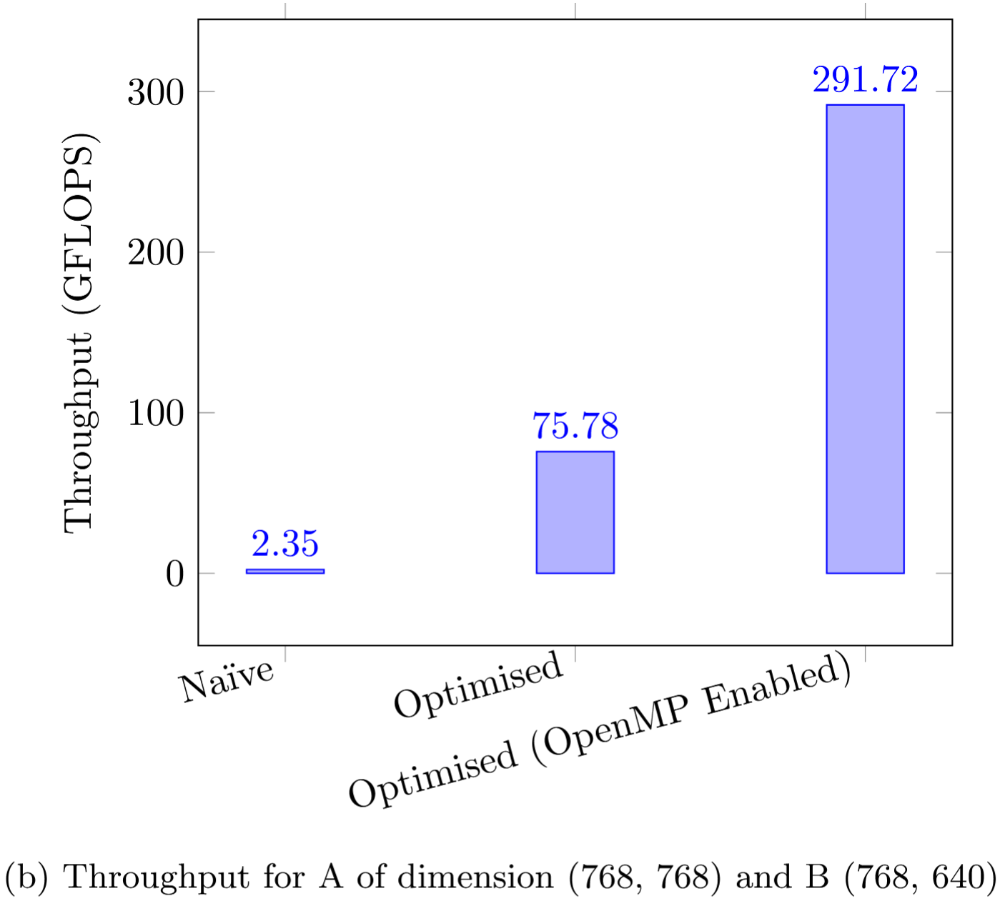

# CMATMUL - Cache Based Matrix Multiplication Kernel

## Abstract

Matrix multiplication is a key operation in computing, data analysis, machine learning and more. Despite its apparent simplicity, the naïve implementation of matrix multiplication can utilise only a small fraction of a modern CPUs' potential performance. In this report, we present an optimised matrix multiplication kernel that leverages advanced techniques including memory access optimisation, register blocking, tiling for cache locality, SIMD vectorisation, and OpenMP parallelisation to achieve a dramatic increase in throughput. Our experiments show that the optimised implementation boosts throughput by over 100x from 2.49 GFLOPS in the naïve approach to 291.72 GFLOPS when multi-threaded.

## Table of Contents

1. [Introduction](#1-introduction)  
2. [Performance Analysis](#2-performance-analysis)  
3. [Methodology](#3-methodology)  
   - [3.1 Memory Access Optimisation](#31-memory-access-optimisation)  
   - [3.2 Register Blocking](#32-register-blocking)  
   - [3.3 Tiling for Cache Locality](#33-tiling-for-cache-locality)  
   - [3.4 SIMD Vectorisation](#34-simd-vectorisation)  
   - [3.5 OpenMP Parallelisation](#35-openmp-parallelisation)  
4. [Experimental Results](#4-experimental-results)  
5. [Conclusion](#5-conclusion)  
6. [References](#6-references)

---

## 1. Introduction

Matrix multiplication, which is defined by the equation `C(m, n) = A(m, k) × B(k, n)` involves computing the dot product of rows of matrix **A** with columns of matrix **B**. Although the operation is conceptually straightforward, the naïve triple-nested loop approach suffers from significant inefficiencies on modern hardware. These inefficiencies arise from poor memory access patterns and underutilisation of the CPU's arithmetic units, resulting in a system that is predominantly memory-bound.

The purpose of this project was to detail a series of systematic optimisations that transform a basic matrix multiplication routine into a high-performance kernel. We begin by analysing the performance limitations of the naïve implementation and then explain how each optimisation technique overcomes specific bottlenecks in the process. Through careful reorganisation of data access and computation, we are able to harness the full computational power of modern processors.

## 2. Performance Analysis

Modern processors, such as those with AVX2 and FMA support, can theoretically achieve peak performances exceeding hundreds of GFLOPS. However, the naïve implementation of matrix multiplication often reaches only around 2.5 GFLOPS on our hardware due to inefficiencies in memory bandwidth utilisation and the underuse of vectorised arithmetic operations. The primary performance bottleneck arises because the algorithm repeatedly loads data from memory in non-sequential patterns and fails to reuse data stored in fast-access CPU registers.

To illustrate the gap between theoretical and actual performance, we analyse the arithmetic intensity of the naïve approach. The limited reuse of loaded data results in frequent cache misses and stalls to the arithmetic units. In contrast, our optimised solution reduces memory operations and maximises data reuse, shifting the workload from being memory-bound to compute-bound.

## 3. Methodology

### 3.1 Memory Access Optimisation

Modern CPUs rely on a hierarchy of caches (L1, L2, L3) to bridge the speed gap between memory and the processor. The naïve matrix multiplication accesses matrix **A** in a cache-friendly row-wise order but accesses matrix **B** in a column-wise (strided) manner. This non-sequential access pattern for **B** leads to poor utilisation of cache lines, causing each cache fetch to deliver only one useful element while wasting the remainder of the data in that cache line.

Our solution restructures the memory access pattern by loading contiguous blocks of **B** (e.g., 8 elements at a time) so that the entire cache line is used effectively. This not only improves spatial locality but also reduces the number of memory loads by a factor of 8. This difference between naïve and optimised access patterns for **B** is illustrated below:

```
Naïve B Access:        Optimised B Access:
+---+                 +-----------------+
| B1|                 | B1 B2 ... B8    |  <-- Contiguous load
+---+                 +-----------------+
   ↓                           ↓
(Stride down)         (Process full cache line)
```

### 3.2 Register Blocking

Registers are the fastest storage units available on the CPU, but their potential remains underutilised if data is used only once after being loaded. In our optimised implementation, we employ register blocking to compute a small block (or patch) of the output matrix **C** entirely within the CPU registers. For example, by processing a 3×4 block, every value from matrix **A** is reused four times, and every value from matrix **B** is reused three times before the results are written back to memory.

This approach significantly increases the compute-to-memory ratio, as multiple arithmetic operations (specifically, fused multiply-add operations) are performed on data residing in registers.

```
Matrix A Block (3 x K)      Matrix B Block (K x 32)
         \                         /
          \   Compute 3x4 Block  /
           -------------------------
           | 3x4 Patch of Matrix C |
           -------------------------
```

### 3.3 Tiling for Cache Locality

Processing large matrices without proper subdivision can overwhelm the cache, leading to unnecessary memory traffic. Tiling, or cache blocking, divides the matrices into smaller submatrices (tiles) that fit within the cache. For instance, by processing a 128×256 tile of matrix **C** at a time, we ensure that once data is loaded into the cache, it is reused fully before being evicted. This approach minimises cache thrashing and maximises the benefit of the earlier optimisations.

This diagram represents how the output matrix **C** is partitioned into smaller tiles:

```
Full Matrix C divided into tiles:
+-----------+-----------+-----------+
|   Tile1   |   Tile2   |   Tile3   |
+-----------+-----------+-----------+
|   Tile4   |   Tile5   |   Tile6   |
+-----------+-----------+-----------+
```

### 3.4 SIMD Vectorisation

Single Instruction, Multiple Data (SIMD) allows the CPU to perform the same operation on multiple data points simultaneously. By employing AVX2 intrinsics such as `_mm256_loadu_ps`, `_mm256_set1_ps`, and `_mm256_fmadd_ps`, our implementation processes 8 single-precision floats concurrently. This vectorised approach drastically reduces the number of cycles per arithmetic operation, aligning the actual performance much closer to the processor's theoretical peak.

```
AVX Register (Broadcast A element):
[ a, a, a, a, a, a, a, a ]

AVX Register (Load B elements):
[ b1, b2, b3, b4, b5, b6, b7, b8 ]

FMA Operation:
Computes: [ a*b1, a*b2, ..., a*b8 ]
```

### 3.5 OpenMP Parallelisation

Modern processors include multiple cores that can execute tasks concurrently; our implementation utilises OpenMP for parallelisation to leverage this. By applying the `#pragma omp parallel for collapse(2)` directive, the workload is evenly distributed across all available cores. Each thread computes a separate tile of the output matrix **C**, allowing the overall computation to scale with the number of cores. 

The parallel execution is shown below:

```
Matrix C divided into independent tiles:
+-----------+   +-----------+   +-----------+
|   Tile1   |   |   Tile2   |   |   Tile3   |
+-----------+   +-----------+   +-----------+
     |                |                |
 Thread1         Thread2          Thread3
```

## 4. Experimental Results

The performance of the matrix multiplication kernel was evaluated using three implementations: a naïve triple-nested loop implementation, a single-threaded optimised version, and a multi-threaded optimised version. The average throughput across a multiplication was measured, with the peak measurement across ten seperate multiplications being taken as the final result. A naïve implementation was utilised in every attempt to ensure the validity of the optimised implementation's result, and provide a baseline throughput measurement. We tested across two different sets of matrix dimmensions, `(384x384) x (384x320)` and `(768x768) x (768x640)`.   

The results, shown below, highlight the importance of optimising this operation. The results with a single-thread show a minimum increase in throughput of over 30x, primarily from SIMD vectorisation and register blocking. This speedup is however less consistent over different matrix sizes. When four threads are utilised upto a 124x increase was achieved from the baseline. This speedup was much more consistent over different sized matrices, likely due to the improved cache block structure.

The optimised implementation was able to maintain a high amount of numerical accuracy with relative error measurements never exceeding $10^{-5}$ when compared with the naïve implementation. Given the use of floating-point numbers here, some error is expected and these results are well within acceptable floating-point tolerances.

<div style="display: flex; justify-content: space-around;">
  <figure>
    
    <figcaption style="text-align: center;">Throughput for A of dimension (384, 384) and B (384, 320)</figcaption>
  </figure>
  <figure>
    
    <figcaption style="text-align: center;">Throughput for A of dimension (768, 768) and B (768, 640)</figcaption>
  </figure>
</div>


> Note: The results shown were the peak recorded results for those matrix dimensions on a 3.6 GHz Intel i7 Processor. Performance may vary depending on specific hardware, matrix dimensions and block sizes. The block sizes used (3×32) were chosen to optimise for the specific hardware used in testing.

## 5. Conclusion
We have demonstrated how a systematic approach to the optimisation 
of matrix multiplication can lead to a significant increase in computational 
performance. By reordering memory accesses, implementing register blocking, 
subdividing the computation into cache-friendly tiles, leveraging SIMD 
vectorisation, and parallelising the workload, we have transformed a 
naïve matrix multiplication kernel into one that fully exploits the 
capabilities of modern processors.

Our experimental results clearly demonstrate the effectiveness of these 
optimisations, with performance improvements of up to 124x over the baseline 
implementation while maintaining numerical accuracy. It should be noted that 
choosing matrix dimensions that align with the 
selected block sizes significantly increases the performance of the system.
Future work could explore auto-tuning of block sizes for different 
hardware configurations, extending these techniques to other linear 
algebra operations, and investigating the applicability of these methods 
to specialised hardware such as GPUs and AI accelerators.

## 6. References

Kazushige Goto and Robert A. van de Geijn. 2008. Anatomy of high-performance matrix multiplication. ACM Trans. Math. Softw. 34, 3, Article 12 (May 2008), 25 pages. https://doi.org/10.1145/1356052.1356053
